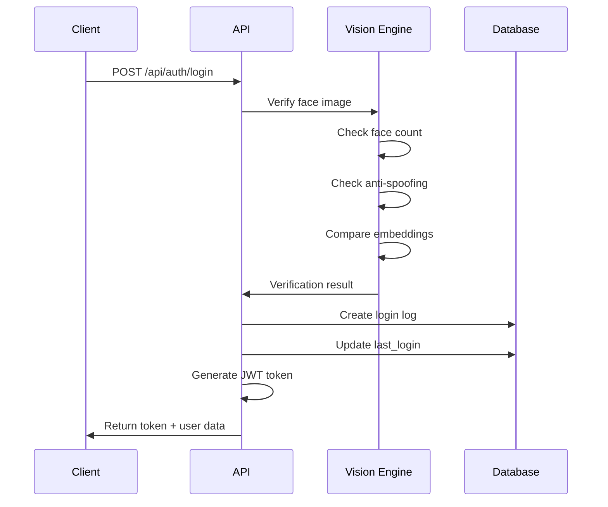

# SecureVision API Documentation

## Base URL
```
http://localhost:8000
```

---

## Authentication Endpoints

### Register User
**POST** `/api/auth/register`

Register a new user with facial scan.

**Request Body:**
```json
{
  "username": "string (min: 3, max: 50)",
  "email": "string (valid email)",
  "face_image": "string (base64 encoded image)"
}
```

**Response (Success - 200):**
```json
{
  "success": true,
  "message": "Registration successful! Welcome to SecureVision.",
  "data": {
    "access_token": "string",
    "token_type": "bearer",
    "user_id": "uuid",
    "username": "string",
    "role": "user"
  }
}
```

**Response (Validation Error - 200):**
```json
{
  "success": false,
  "message": "Multiple faces detected. Only one person allowed.",
  "data": {
    "face_count": 2,
    "is_real": null
  }
}
```

---

### User Login
**POST** `/api/auth/login`

Authenticate user with facial verification.

**Request Body:**
```json
{
  "username": "string",
  "face_image": "string (base64 encoded image)"
}
```

**Response (Success - 200):**
```json
{
  "success": true,
  "message": "Verification success – Entering secure workspace.",
  "data": {
    "access_token": "string",
    "token_type": "bearer",
    "user_id": "uuid",
    "username": "string",
    "role": "user",
    "similarity_score": 0.87
  }
}
```

**Response (Multiple Faces - 200):**
```json
{
  "success": false,
  "message": "Multiple faces detected. Only one person allowed.",
  "data": {
    "similarity_score": 0,
    "is_real": null,
    "face_count": 2
  }
}
```

**Response (Anti-Spoofing Failed - 200):**
```json
{
  "success": false,
  "message": "Anti-spoofing failed. Live presence required.",
  "data": {
    "similarity_score": 0,
    "is_real": false,
    "face_count": 1
  }
}
```

---

### Admin Login
**POST** `/api/auth/admin-login`

Authenticate admin with email and password.

**Request Body:**
```json
{
  "email": "string (valid email)",
  "password": "string"
}
```

**Response (Success - 200):**
```json
{
  "access_token": "string",
  "token_type": "bearer",
  "user_id": "uuid",
  "username": "string (email)",
  "role": "admin"
}
```

---

## User Endpoints

> **Authorization Required:** Bearer Token in `Authorization` header

### Get User Profile
**GET** `/api/user/profile`

Fetch current user's profile information.

**Headers:**
```
Authorization: Bearer <token>
```

**Response (200):**
```json
{
  "id": "uuid",
  "username": "string",
  "email": "string",
  "is_blocked": false,
  "last_login": "2026-01-29T22:56:43Z",
  "created_at": "2026-01-29T20:00:00Z"
}
```

---

### Check User Status
**GET** `/api/user/status`

Check if user account is active or blocked.

**Headers:**
```
Authorization: Bearer <token>
```

**Response (200):**
```json
{
  "is_blocked": false,
  "status": "active"
}
```

---

### Get Login History
**GET** `/api/user/login-history?limit=50`

Retrieve user's login history with security metrics.

**Headers:**
```
Authorization: Bearer <token>
```

**Query Parameters:**
- `limit` (optional): Number of records to return (default: 50)

**Response (200):**
```json
[
  {
    "id": "uuid",
    "timestamp": "2026-01-29T22:56:43Z",
    "status": "success",
    "similarity_score": 0.87,
    "is_real": true,
    "face_count": 1,
    "error_message": null
  },
  {
    "id": "uuid",
    "timestamp": "2026-01-29T21:30:00Z",
    "status": "spoofing_attempt",
    "similarity_score": null,
    "is_real": false,
    "face_count": 1,
    "error_message": "Anti-spoofing failed. Live presence required."
  }
]
```

**Status Values:**
- `success` - Login successful
- `fail` - Verification failed (low similarity)
- `spoofing_attempt` - Anti-spoofing check failed
- `multiple_faces` - More than one face detected

---

## Admin Endpoints

> **Authorization Required:** Bearer Token with `admin` role

### Get All Users
**GET** `/api/admin/users`

Retrieve list of all registered users.

**Headers:**
```
Authorization: Bearer <token>
```

**Response (200):**
```json
[
  {
    "id": "uuid",
    "username": "john_doe",
    "email": "john@example.com",
    "is_blocked": false,
    "last_login": "2026-01-29T22:56:43Z",
    "created_at": "2026-01-29T20:00:00Z"
  },
  {
    "id": "uuid",
    "username": "jane_smith",
    "email": "jane@example.com",
    "is_blocked": true,
    "last_login": "2026-01-29T18:00:00Z",
    "created_at": "2026-01-28T10:00:00Z"
  }
]
```

---

### Block/Unblock User
**POST** `/api/admin/block-user`

Block or unblock a user. This triggers real-time session termination.

**Headers:**
```
Authorization: Bearer <token>
```

**Request Body:**
```json
{
  "user_id": "uuid",
  "block_status": true
}
```

**Response (200):**
```json
{
  "success": true,
  "message": "User successfully blocked",
  "user_id": "uuid",
  "is_blocked": true
}
```

> **Note:** When `block_status` is set to `true`, the user's active session is immediately terminated via Supabase Realtime.

---

## Health Check

### Health Check
**GET** `/health`

Check if the API is running.

**Response (200):**
```json
{
  "status": "healthy",
  "timestamp": "2026-01-29T22:56:43Z"
}
```

---

## Error Responses

### 400 Bad Request
```json
{
  "detail": "Username already exists"
}
```

### 401 Unauthorized
```json
{
  "detail": "Not authenticated"
}
```

### 403 Forbidden
```json
{
  "detail": "Admin access required"
}
```

### 404 Not Found
```json
{
  "detail": "User not found"
}
```

### 500 Internal Server Error
```json
{
  "detail": "Failed to create user"
}
```

---

## Vision Engine Validation

### Single-Face Enforcement

The vision engine performs the following checks in order:

1. **Face Detection**: Uses RetinaFace detector
   - ❌ 0 faces → "No face detected"
   - ❌ 2+ faces → "Multiple faces detected. Only one person allowed."
   - ✅ 1 face → Continue

2. **Anti-Spoofing**: Passive liveness detection
   - ❌ `is_real: false` → "Anti-spoofing failed. Live presence required."
   - ✅ `is_real: true` → Continue

3. **Face Matching**: Cosine similarity comparison
   - ❌ `similarity < 0.6` → "Face verification failed"
   - ✅ `similarity >= 0.6` → Access granted

---

## Authentication Flow



---

## Rate Limiting (Recommended)

For production deployment, implement rate limiting:

```python
# Add to main.py
from slowapi import Limiter
from slowapi.util import get_remote_address

limiter = Limiter(key_func=get_remote_address)

@app.post("/api/auth/login")
@limiter.limit("5/minute")
async def login_user(...):
    ...
```

---

## CORS Configuration

Current CORS settings allow:
- `http://localhost:5173` (Vite dev server)
- `http://localhost:3000` (Alternative React dev)

Update `FRONTEND_URL` in `.env` for production.

---

## Security Best Practices

1. **Always use HTTPS** in production
2. **Rotate JWT_SECRET** regularly
3. **Enable rate limiting** on authentication endpoints
4. **Monitor login logs** for suspicious activity
5. **Usestrong admin passwords** with bcrypt hashing
6. **Enable Supabase RLS** (already configured)
7. **Set proper CORS origins**

---

## Testing with cURL

### Register User
```bash
curl -X POST http://localhost:8000/api/auth/register \
  -H "Content-Type: application/json" \
  -d '{
    "username": "testuser",
    "email": "test@example.com",
    "face_image": "data:image/jpeg;base64,/9j/4AAQ..."
  }'
```

### Login
```bash
curl -X POST http://localhost:8000/api/auth/login \
  -H "Content-Type: application/json" \
  -d '{
    "username": "testuser",
    "face_image": "data:image/jpeg;base64,/9j/4AAQ..."
  }'
```

### Get User Profile
```bash
curl -X GET http://localhost:8000/api/user/profile \
  -H "Authorization: Bearer YOUR_TOKEN_HERE"
```

### Block User (Admin)
```bash
curl -X POST http://localhost:8000/api/admin/block-user \
  -H "Authorization: Bearer ADMIN_TOKEN_HERE" \
  -H "Content-Type: application/json" \
  -d '{
    "user_id": "user-uuid-here",
    "block_status": true
  }'
```

---

## Support

For issues or questions, check:
1. Backend logs in terminal
2. Supabase dashboard for database errors
3. Browser console for frontend errors
4. [README.md](file:///e:/SECURE%20VISION%20PROJECT/securevision/README.md) for troubleshooting
